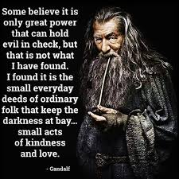

# [GandalfTheWise](https://ctflearn.com/challenge/936) (30)
Downloading and opening the [image](https://ctflearn.com/challenge/download/936) we are presented with: <br />
 <br />
Immediately we can see that the image is very small, which leads me to believe there may be something embedded inside <br />
In an attempt to get the filesize, I ran `file Gandalf.jpg` on got some interesting output: <br />
```
$ file Gandalf.jpg
img/Gandalf.jpg: JPEG image data, JFIF standard 1.01, aspect ratio, density 1x1, segment length 16, comment: "Q1RGbGVhcm57eG9yX2lzX3lvdXJfZnJpZW5kfQo=", comment: "xD6kfO2UrE5SnLQ6WgESK4kvD/Y/rDJPXNU45k/p", comment: "h2riEIj13iAp29VUPmB+TadtZppdw3AuO7JRiDyU", baseline, precision 8, 225x225, frames 3

```
<br />
Decoding the first comment gives us a false flag: <br />
```
$ echo "Q1RGbGVhcm57eG9yX2lzX3lvdXJfZnJpZW5kfQo=" | base64 -d
CTFlearn{xor_is_your_friend}

$ echo "xD6kfO2UrE5SnLQ6WgESK4kvD/Y/rDJPXNU45k/p" | base64 -d
�>�|픬NR��:Z+�/�?�2O\�8�O� 

$ echo "h2riEIj13iAp29VUPmB+TadtZppdw3AuO7JRiDyU" | base64 -d
�j���� )��T>`~M�mf�]�p.;�Q�<�
```
The other two comments appear to decode into binary jibberish, but now we know XOR is involved. <br />
The challenge texts says we may need a script for this, I tried XORing the bytes of binary against each other and got nowhere. <br />
The issue is that python was XORing multiple bytes of binary jibberish against the corresponding byte of another string <br />
<br />
The solution is to encode `base64`'s binary output into single byte hexadecimal. We can do this with: <br />
```
$ echo "xD6kfO2UrE5SnLQ6WgESK4kvD/Y/rDJPXNU45k/p" | base64 -d | xxd -i
0xc4, 0x3e, 0xa4, 0x7c, 0xed, 0x94, 0xac, 0x4e, 0x52, 0x9c, 0xb4, 0x3a,
0x5a, 0x01, 0x12, 0x2b, 0x89, 0x2f, 0x0f, 0xf6, 0x3f, 0xac, 0x32, 0x4f,
0x5c, 0xd5, 0x38, 0xe6, 0x4f, 0xe9

$ echo "h2riEIj13iAp29VUPmB+TadtZppdw3AuO7JRiDyU" | base64 -d | xxd -i
0x87, 0x6a, 0xe2, 0x10, 0x88, 0xf5, 0xde, 0x20, 0x29, 0xdb, 0xd5, 0x54,
0x3e, 0x60, 0x7e, 0x4d, 0xa7, 0x6d, 0x66, 0x9a, 0x5d, 0xc3, 0x70, 0x2e,
0x3b, 0xb2, 0x51, 0x88, 0x3c, 0x94

```
<br />
Now we can copy these hexadecimal arrays into a simple C program, and XOR each byte against its correspondent. <br />
```
#include<stdio.h>
int main(void) {
	unsigned char bytes1[] = { 0xc4, 0x3e, 0xa4, 0x7c, 0xed, 0x94, 0xac, 0x4e, 0x52, 0x9c, 0xb4, 0x3a, 0x5a, 0x01, 0x12, 0x2b, 0x89, 0x2f, 0x0f, 0xf6, 0x3f, 0xac, 0x32, 0x4f, 0x5c, 0xd5, 0x38, 0xe6, 0x4f, 0xe9 };
	unsigned char bytes2[] = { 0x87, 0x6a, 0xe2, 0x10, 0x88, 0xf5, 0xde, 0x20, 0x29, 0xdb, 0xd5, 0x54, 0x3e, 0x60, 0x7e, 0x4d, 0xa7, 0x6d, 0x66, 0x9a, 0x5d, 0xc3, 0x70, 0x2e, 0x3b, 0xb2, 0x51, 0x88, 0x3c, 0x94 };
	
	for(int i=0;i<30;i++)
		putchar(bytes1[i] ^ bytes2[i]);
}

```
<br />
The output is our flag: `CTFlearn{Gandalf.BilboBaggins}` <br />
