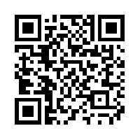

# [QR Code](https://ctflearn.com/challenge/228) (30)
Downloading the file from the [link](https://mega.nz/#!eGYlFa5Z!8mbiqg3kosk93qJCP-DBxIilHH2rf7iIVY-kpwyrx-0), we are given a QR code in png format.  
  
When we try scanning it with a phone, the code resolves to base64 encoded text: `c3ludCB2ZiA6IGEwX29icWxfczBldHJnX2RlX3BicXI=`  
We can decode it with `echo c3ludCB2ZiA6IGEwX29icWxfczBldHJnX2RlX3BicXI= | base64 -d`  
With that, we are given `synt vf : a0_obql_s0etrg_de_pbqr` it's obviously not jibberish, but it's not clear what to do next.  
It seems to be a coded message, the "synt" could be *flag* and the "vf" could be *is*, lets try and see if it was encoded as a caesar cipher  
By visiting [ascii.cl](https://ascii.cl), we can find **s** on the table and subtract it's ascii value from **f**'s ascii value, giving us 13.  
Let's keep going, **y** - 13 = **l**  
We're definitely on the right track, to speed this up let's use an [online caesar cipher solver](https://dcode.fr/caesar-cipher).  
Using the shift 13, the ciphertext becomes *n0_body_f0rget_qr_code*  
This leaves us with our flag: `n0_body_f0rget_qr_code`  

This is actually a specific kind of caesar cipher, one in which the shift is 13, called [ROT 13](https://en.wikipedia.org/wiki/ROT13).
